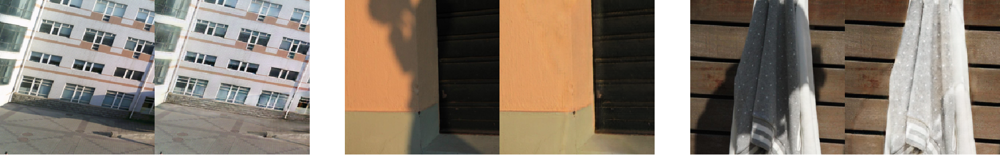
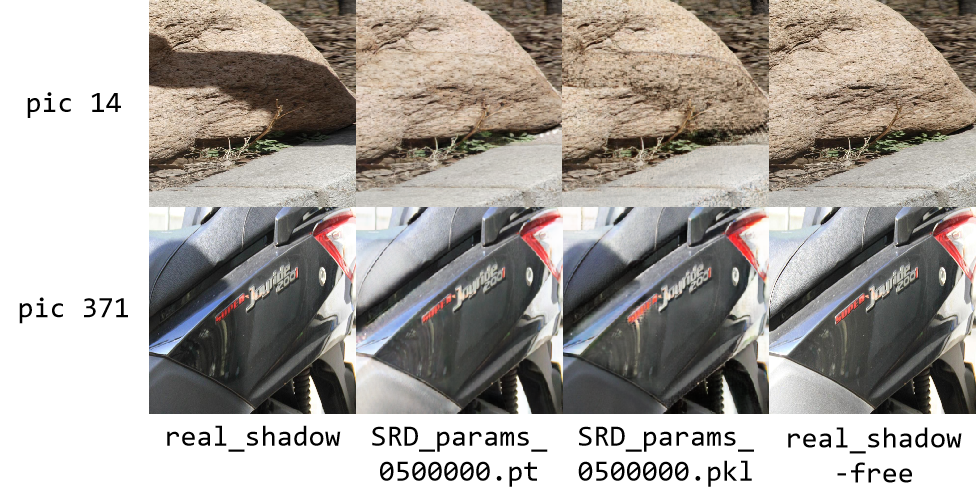

# Jittor_DC-ShadowNet

## 1. Introduction

本项目是新芽计划培育期的考核项目，该项目目标是在 Jittor 框架下复现 DC-ShadowNet 这个去阴影网络模型的代码。

This project is an assessment task under the cultivation phase of the GrokCV Sprouts, aiming to reproduce the code of the DC-ShadowNet shadow removal network model within the Jittor framework.

- 想要了解更多有关**新芽计划**的信息，可观看[该视频](https://www.bilibili.com/video/BV1rbPBeGEJD)。

  - To learn more about the **GrokCV Sprouts**, please watch [this video](https://www.bilibili.com/video/BV1rbPBeGEJD).


- 想要了解更多有关 **DC-ShadowNet** 的内容，可查阅[原论文](https://openaccess.thecvf.com/content/ICCV2021/papers/Jin_DC-ShadowNet_Single-Image_Hard_and_Soft_Shadow_Removal_Using_Unsupervised_Domain-Classifier_ICCV_2021_paper.pdf)和原作者的 [Github 项目](https://github.com/jinyeying/DC-ShadowNet-Hard-and-Soft-Shadow-Removal).

  - To learn more about **DC-ShadowNet**, please refer to [the original paper](https://openaccess.thecvf.com/content/ICCV2021/papers/Jin_DC-ShadowNet_Single-Image_Hard_and_Soft_Shadow_Removal_Using_Unsupervised_Domain-Classifier_ICCV_2021_paper.pdf) and the author’s [GitHub repository](https://github.com/jinyeying/DC-ShadowNet-Hard-and-Soft-Shadow-Removal).

- 想要了解更多有关 **Jittor** 框架的内容，请参考他们的 [Github 项目](https://github.com/Jittor/jittor)。

  - To learn more about **Jittor** framework, please refer to their [Github repository](https://github.com/Jittor/jittor).

## 2. Preparation
### 2.1 environment

在复现该论文时，我搭建的环境基于 `Ubuntu=24.04, python=3.12.11, cuda=12.4, cudnn=9.1.1.17` .

When reproducing this paper, I built the environment based on `Ubuntu=24.04, python=3.12.11, cuda=12.4, cudnn=9.1.1.17`.

更多环境配置，请参考 [requirements.txt](requirements.txt) .

For additional environment configuration details, please refer to [requirements.txt](requirements.txt).

### 2.2 Dataset
相关数据集的下载，请参照论文作者的[ Github 项目](https://github.com/jinyeying/DC-ShadowNet-Hard-and-Soft-Shadow-Removal?tab=readme-ov-file#datasets) 。

For downloading the relevant datasets, please refer to the author's [GitHub project](https://github.com/jinyeying/DC-ShadowNet-Hard-and-Soft-Shadow-Removal?tab=readme-ov-file#datasets). 

遗憾的是，在训练结束后，我发现 SRD 数据集存在着文件名不匹配的问题，这导致了训练、测试、评估阶段的一系列问题。由于我时间和精力有限，目前我只修改了 SRD 数据集的 test 数据集，可以从[这里](https://pan.baidu.com/s/1IX8XQTvU3GaCyP8sskYHFQ?pwd=y2yz)下载。

Unfortunately, upon completing the training, I discovered file name mismatches in the SRD dataset, which caused issues during the training, testing, and evaluation phases. Due to limited time and resources, I have currently only modified the test set of the SRD dataset, which can be downloaded [here](https://pan.baidu.com/s/1IX8XQTvU3GaCyP8sskYHFQ?pwd=y2yz).

### 2.3 Pre-train model
目前我只在 SRD 数据集上完成训练，可以从[这里](https://pan.baidu.com/s/1IX8XQTvU3GaCyP8sskYHFQ?pwd=y2yz)下载。

Currently, I have only completed training on the SRD dataset, which may be downloaded [here](https://pan.baidu.com/s/1IX8XQTvU3GaCyP8sskYHFQ?pwd=y2yz).

## 3. Operation methods
### 3.1 Train
#### 3.1.1 Preparation

```
Jittor_DC-ShadowNet
|-- dataset
    |-- SRD
        |-- testA   ## shadow
        |-- testB   ## shadow-free
        |-- testC   ## chromaticity maps
        |-- trainA  ## shadow
        |-- trainB  ## shadow-free
        |-- trainC  ## chromaticity maps
```

#### 3.1.2 Commands
``` 
python main_train.py --dataset SRD  --iteration 500000
```
- 使用 shadow-free chromaticity loss 时，添加命令  `--use_ch_loss True`

  - If you want to use shadow-free chromaticity loss, add `--use_ch_loss True`
- 使用 shadow-robust feature loss 时，添加命令 `--use_pecp_loss True`

  - If you want to use shadow-free chromaticity loss, add `--use_pecp_loss True`
- 使用 boundary smoothness loss 时，添加命令 `--use_smooth_loss True`

  - If you want to use shadow-free chromaticity loss, add `--use_smooth_loss True`

#### 3.1.3 Outputs
``` 
Jittor_DC-ShadowNet
|-- results
    |-- SRD
        |-- model
            |-- SRD_params_******.pkl  ## saved every save_freq iterations
        |-- train_img
    |-- SRD_params_latest.pkl          ## saved every 1000 iterations
|-- Discriminator loss.png
|-- Generator loss.png
```
#### 3.1.4 Checkpoint resuming
根据终端输出，将 `SRD_params_latest.pkl` 移至 `model` 文件夹下，修改 `latest` 为其保存时的迭代次数。

Based on terminal output, move `SRD_params_latest.pkl` to the `model` folder, and rename `latest` to the corresponding iteration number when saved.

#### 3.3.5 Loss function

<p align="left">
    
</p>
<p align="left">
    
</p>


### 3.2 Test dataset
#### 3.2.1 Preparation
``` 
Jittor_DC-ShadowNet
|-- results
    |-- SRD
        |-- model
            |-- SRD_params_500000.pkl
```

#### 3.2.2 Commands
``` 
python main_test.py --dataset SRD
```

#### 3.2.3 Outputs
``` 
Jittor_DC-ShadowNet
|-- results
    |-- SRD
        |-- 500000
            |-- inputA_outputB
            |-- outputB
```

### 3.3 Test several images
#### 3.3.1 Preparation

``` 
Jittor_DC-ShadowNet
|-- test_single_input
|-- results
    |-- SRD
        |-- model
            |-- SRD_params_500000.pkl
```
#### 3.3.2 Commands
``` 
python main_test_single.py --dataset SRD
```

#### 3.3.3 Outputs
``` 
Jittor_DC-ShadowNet
|-- results
    |-- inputA_outputB
    |-- outputB
```
<p align="left">
    
</p>

### 3.4 Evaluate
#### 3.4.1 Preparation
``` 
Jittor_DC-ShadowNet
|-- evaluation
    |-- fake_shadow-free  ## predicted shadow-free image
    |-- real_shadow-free  ## ground-truth image
```
#### 3.4.2 Commands
``` 
python evaluate.py
```
#### 3.4.3 Outputs
``` 
 [*] Load SUCCESS
pic    1 : RMSE = **.****** , PSNR = **.******
...
pic **** : RMSE = **.****** , PSNR = **.******
 [*] Evaluate COMPLETE in *.***s
RMSE: average = **.****** , min = **.******(*) , max = **.******(*)
PSNR: average = **.****** , min = **.******(*) , max = **.******(*)
```
#### 3.4.4 Comparison
由于我在训练后半段才使用论文引入的三个 loss 函数，并且受到了数据集不匹配的影响，从评估结果上看我训练的模型比论文作者训练的模型较差，但从另一个角度来看，这也可以作为一个不严谨的消融实验，验证三个 loss 函数在 DC-ShadowNet 的作用。

Due to introducing the three loss functions from the paper only in the later phase of training, and being affected by dataset mismatch issues, my trained model performed worse than the authors' model, according to evaluation results. However, from another perspective, this could serve as an informal ablation study demonstrating the role of these three loss functions in DC-ShadowNet.

- RMSE Comparison

|                         |  average  |      min      |      max       |
|:-----------------------:|:---------:|:-------------:|:--------------:|
|  SRD_params_0500000.pt  | 7.792953  | 2.037361(285) | 45.453903(14)  |
| SRD_params_0500000.pkl  | 10.920709 | 2.775144(288) | 60.978275(371) |

- PSNR Comparison

|                         |  average   |      min       |       max       |
|:-----------------------:|:----------:|:--------------:|:---------------:|
|  SRD_params_0500000.pt  | 31.683808  | 14.979393(14)  | 41.949448(285)  |
| SRD_params_0500000.pkl  | 28.859564  | 12.427299(371) | 39.265099(288)  |

<p align="left">
    
</p>

## 4. Acknowledgements

首先，我要感谢论文的作者以及他们的团队，感谢他们发表了如此优秀的论文，也感谢他们在 Github 项目中详细阐述了操作方法，让我这个初学者有机会去复现他们的代码。

First and foremost, I would like to express my sincere gratitude to the authors of the paper and their research team for publishing such an outstanding work. They detailed methodology description in the GitHub repository , enabling a beginner like myself to successfully reproduce their code implementation.

其次，我要感谢新芽计划的老师和同学，它们在我复现代码的过程中提供了不少帮助。

Secondly, my profound appreciation goes to the mentors and peers in GrokCV Sprouts. Their technical support and constructive suggestions significantly facilitated my code reproduction process.

最后，我要感谢 Jittor 框架的开发团队，尽管目前还有改进的空间（例如在编程过程中，我发现 Jittor 没有对标 Pytorch 的 spectral_norm 函数），但是它确实大大加快了训练速度，给我留下了非常深刻的印象。

Lastly, special thanks should be given to the development team of the Jittor framework. While there remains room for improvement (for instance, I noticed Jittor currently lacks equivalent implementations of certain PyTorch functions like spectral_norm), its remarkable computational efficiency dramatically accelerated my model training process, which impressed me profoundly.
